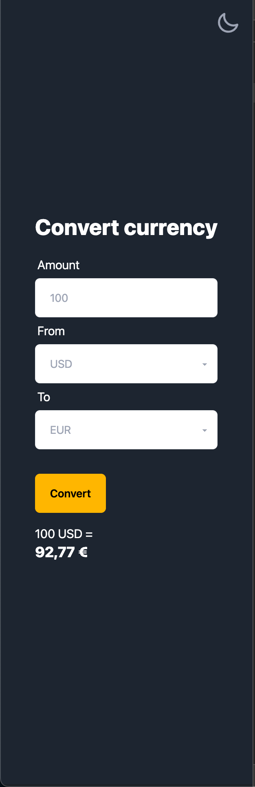
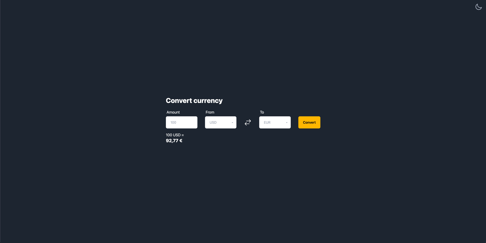
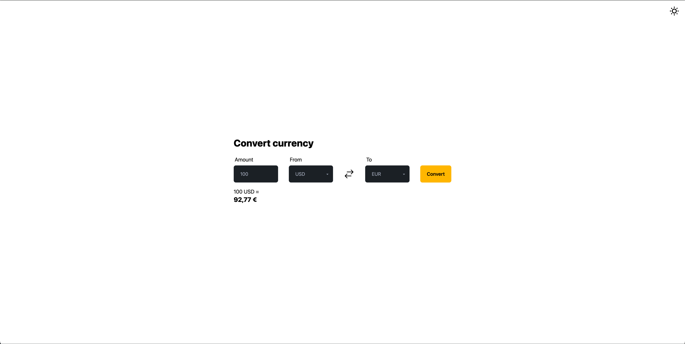

# Welcome to Our Vite.js + Vue Frontend Project!

## Introduction

Welcome to our frontend repository! This project serves as a frontend interface for our currency converter application. Utilizing Vite.js and Vue, we've crafted an efficient and powerful user interface to facilitate seamless currency exchange operations for our application.

## Tech Stack

- **Vite.js**: Next-gen frontend tooling for Vue.js development.
- **Vue**: Progressive JavaScript framework for building user interfaces.
- **Tailwind CSS & Daisy UI**: Utility-first CSS framework & component library for rapid frontend development.

## Getting Started

1. **Clone the Project**

2. **Install Dependencies**:

   ```bash
   npm install
   ```

3. **Run Development Server**:

   ```bash
   npm run dev
   ```

   This command will spin up a development server and open your default browser to preview the application.

## Screenshot




